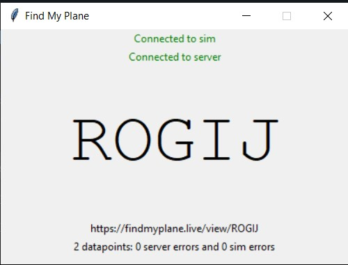

# FindMyPlane.Live client

This is the client software for [findmyplane.live](https://findmyplane.live), a simple, free, no-nonsense flight map for Microsoft Flight Simulator X.

This is what you need to download and run on the computer running the simulator.

## Installation (easy version)

1. Download the repositry and expand it somewhere.

## Note: You MUST install the 32 bit version of Python as FSX and simconnect.dll are 32 bit. This will not work for FSX with the 64 bit python!!

## Usage (easy version)

1. Load Microsoft Flight Simulator X and load an airport.

2. Open a cmd prompt from the findmyplane-client directory and type: python findmyplane-client.pyw or execute the file findmyplane-client.exe from the /dist folder.

3. Once the client has connected to your simulator and the server it will provide you with a link and five digit ident code such as ABCDE

4. Copy and paste this link to a browser OR

5. Visit https://findmyplane.live and enter the code

6. Your plane location will be displayed

## Supported devices

Microsoft Flight Simulator X only runs on Windows. The client should run on the same Windows computer that your simulator is running on.

You can view the map on most browsers or devices. This doesn't need to be on the same computer or network as the simulator.

Supported devices:
- PC
- Mac
- Linux
- Chromebook
- iOS
- Android

Supported browsers:
- Chrome (Desktop and mobile)
- Firefox (Desktop and mobile)
- Safari (Desktop and mobile)
- Edge

Unsupported browsers:
- Internet Explorer

## Support

If you are stuck then please raise an issue through [github issues](https://github.com/bernbout/findmyplane-client4FSX/issues).

## Advanced installation and usage

The source code is also provided and is open source. You can download findmyplane-client.py and run through your Python 3 interpreter.

Required pip libraries:
- [requests](https://pypi.org/project/requests/)
- [SimConnect](https://pypi.org/project/SimConnect/)

The server is also open source and on github as [hankhank10/findmyplane-server](https://github.com/hankhank10/findmyplane-server). Pull requests on both repos welcome.

